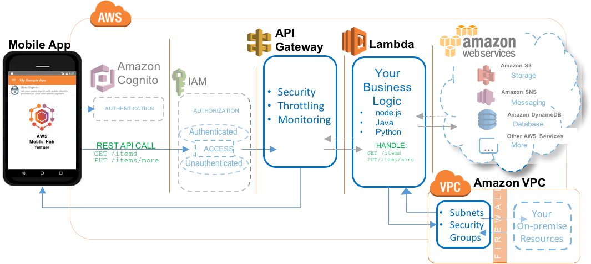

.. Copyright 2010-2018 Amazon.com, Inc. or its affiliates. All Rights Reserved.

   This work is licensed under a Creative Commons Attribution-NonCommercial-ShareAlike 4.0
   International License (the "License"). You may not use this file except in compliance with the
   License. A copy of the License is located at http://creativecommons.org/licenses/by-nc-sa/4.0/.

   This file is distributed on an "AS IS" BASIS, WITHOUT WARRANTIES OR CONDITIONS OF ANY KIND,
   either express or implied. See the License for the specific language governing permissions and
   limitations under the License.

.. _Cloud-Logic:

###########
Cloud Logic
###########

.. meta::
   :description: Use the Cloud Logic mobile backend service feature to add business logic functions
      in the cloud and extend to other AWS services for your mobile app, with no cost for server set
      up or maintenance.

Choose the |AMHlong| Cloud Logic mobile backend service feature to:

* Add business logic functions in the cloud with no cost for server set up or maintenance

* Extend your app to other services within AWS and beyond

`Create a free Mobile Hub project and add the Cloud Logic feature.
<https://console.aws.amazon.com/mobilehub/home#/>`__

.. _cloud-logic-details:

Feature Details
===============

The following image show Cloud Logic using the combination of |ABPlong| and |LAMlong| to implement
serverless business logic and extension to other services.

The Cloud Logic feature lets you build backend services using `AWS Lambda
<https://aws.amazon.com/lambda/getting-started/>`__ functions that you can call from your mobile app. Using Cloud Logic, you
can run code in the cloud to process business logic for your apps and share the same code for both
iOS and Android apps. The Cloud logic feature is powered by |LAMlong| functions, which allow you to
write code without worrying about managing frameworks and scaling backend infrastructure. You can
write your functions in JavaScript, Java, or Python.

The |LAM| functions you create are exposed to your app as a REST API by |ABPlong| which also
provides a single secure endpoint with flexible traffic monitoring and throttling capabilities.

.. _cloud-logic-ataglance:

Cloud Logic At a Glance
=======================

.. list-table::
   :widths: 1 6

   * - **AWS services and resources configured**

     - - :guilabel:`Amazon API Gateway` (see `Amazon API Gateway Developer Guide <http://docs.aws.amazon.com/apigateway/latest/developerguide/>`__)

         `Concepts <http://docs.aws.amazon.com/apigateway/latest/developerguide/api-gateway-basic-concept.html>`__ | `Console <https://console.aws.amazon.com/apigateway/>`__ | `Pricing <https://aws.amazon.com/api-gateway/pricing/>`__

       - :guilabel:`AWS Lambda` (see `AWS Lambda Developer Guide <http://docs.aws.amazon.com/lambda/latest/dg/>`__)

         `Concepts <http://docs.aws.amazon.com/lambda/latest/dg/>`__ | `Console <https://console.aws.amazon.com/lambda/>`__ | `Pricing <https://aws.amazon.com/lambda/pricing/>`__

       - :guilabel:`Amazon Virtual Private Cloud` (see `Amazon VPC User Guide <http://docs.aws.amazon.com/AmazonVPC/latest/UserGuide/>`__)

         `Concepts <http://docs.aws.amazon.com/AmazonVPC/latest/UserGuide/VPC_Introduction.html#Overview>`__ | `Console <https://console.aws.amazon.com/vpc/>`__ | `Pricing <http://docs.aws.amazon.com/AmazonVPC/latest/UserGuide/VPC_Introduction.html#Paying>`__

       - :guilabel:`AWS CloudFormation` (see `AWS CloudFormation User Guide <http://docs.aws.amazon.com/AWSCloudFormation/latest/UserGuide/>`__)

         `Concepts <http://docs.aws.amazon.com/AWSCloudFormation/latest/UserGuide/cfn-whatis-concepts.html>`__ | `Console <https://console.aws.amazon.com/cloudformation/home>`__ | `Pricing <https://aws.amazon.com/cloudformation/pricing/>`__

       |AMH|-enabled features use |COG| for authentication and |IAM| for authorization. For more information, see :ref:`User Sign-in <user-sign-in>`. For more information, see :ref:`resources-cloud-logic`.

   * - **Configuration options**

     - This feature enables the following mobile backend capabilities:

       - Provides a default Hello World |LAM| function that accepts the parameter value entered by the app user and returns it back to an app.

       - Enables you to choose an existing function from the list provided or use the |LAMlong| console to create new functions.

   * - **Quickstart app demos**

     - This feature adds the following functionality to a quickstart app generated by |AMH|:

       - User can specify an |LAMlong| function by name, provide parameters and call a function and see the value returned by the function

.. _resources-cloud-logic:

Viewing AWS Resources Provisioned for this Feature
==================================================

The following image shows the |AMH| :guilabel:`Resources` pane displaying elements typically
provisioned for the Cloud Logic feature.

.. image:: images/resources-cloud-logic.png

.. _quickstart-cloud-logic:

Quickstart App Details
======================

Your quickstart app includes code to use |LAMlong| APIs to invoke any functions you have selected in
your project. Adding Cloud Logic to your quickstart app provides a Hello World default |LAM|
function. You can also choose an existing |LAM| function from your AWS account, or you can create a
new one. When you choose the edit button, you are taken to the function editor in the |LAMlong|
console. From the |LAM| console, you can edit the code directly or upload a package of source and
libraries as a .zip file.

In the demo screen of the Cloud Logic quickstart app, you can enter the name and input parameters of
the |LAM| function you wish to invoke. The quickstart app then calls your |LAM| function and
displays the results it returns.

