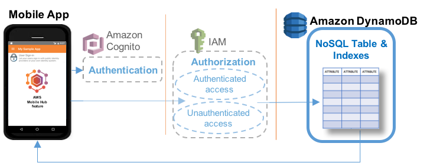
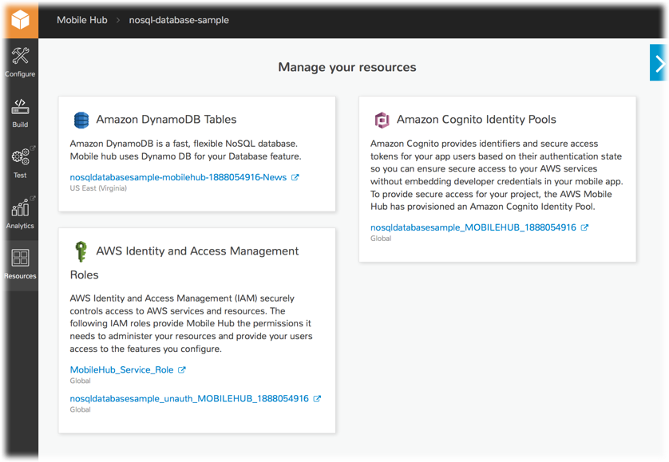

.. Copyright 2010-2018 Amazon.com, Inc. or its affiliates. All Rights Reserved.

   This work is licensed under a Creative Commons Attribution-NonCommercial-ShareAlike 4.0
   International License (the "License"). You may not use this file except in compliance with the
   License. A copy of the License is located at http://creativecommons.org/licenses/by-nc-sa/4.0/.

   This file is distributed on an "AS IS" BASIS, WITHOUT WARRANTIES OR CONDITIONS OF ANY KIND,
   either express or implied. See the License for the specific language governing permissions and
   limitations under the License.

.. _NoSQL-Database:

##############
NoSQL Database
##############

.. meta::
   :description: Use the NoSQL Database mobile backend service feature in your mobile app to add
      database capabilities that are easy to develop and provide scalable performance and cost.

Choose the |AMH| NoSQL Database mobile backend feature to:

* Add easy to develop database capabilities with scalable performance and cost

`Create a free Mobile Hub project and add the NoSQL DB feature in
minutes. <https://console.aws.amazon.com/mobilehub/home#/>`__

.. _nosql-details:

Feature Details
===============

The following image shows the typical connection between a mobile app and |DDBlong| using the NoSQL
pattern.

The NoSQL Database feature uses `Amazon DynamoDB <https://aws.amazon.com/dynamodb/>`__ to enable you to create database
tables that can store and retrieve data for use by your apps.

NoSQL databases are widely recognized as the method of choice for many mobile backend solutions due
to their ease of development, scalable performance, high availability, and resilience. For more
information, see `From SQL to NoSQL <http://docs.aws.amazon.com/amazondynamodb/latest/developerguide/SQLtoNoSQL.html>`__ in the :title:`Amazon DynamoDB Developer Guide`.

.. _nosqldb-ataglance:

NoSQL Database At a Glance
==========================

.. list-table::
   :widths: 1 6

   * - **AWS services and resources configured**

     - - **Amazon DynamoDB Tables** (see `Working with Tables in DynamoDB <http://docs.aws.amazon.com/amazondynamodb/latest/developerguide/WorkingWithTables.html>`__)

         `Concepts <http://docs.aws.amazon.com/amazondynamodb/latest/developerguide/>`__ | `Console <https://console.aws.amazon.com/dynamodb/home>`__ | `Pricing <https://aws.amazon.com/dynamodb/pricing/>`__

       |AMH|-enabled features use |COG| for authentication and |IAM| for authorization. For more information, see :ref:`User Sign-in <user-sign-in>`. For more information, see :ref:`resources-nosqldb`.

   * - **Configuration options**

     - This feature enables the following mobile app backend capabilities:

       :ref:`nosqldb-table` - Using custom schema, based on a sample schema provided, or by using a  wizard that guides you through choices while creating a table.

       :ref:`nosqldb-permissions` - Access to your app's data can be:

          - :guilabel:`Public` (enables any mobile app user to read or write any item in the table).

          - :guilabel:`Protected` (enables any mobile app user to read any item in the table but only the owner of an item can update or delete it).

          - :guilabel:`Private` (enables only the owner of an item to read and write to a table) For more information, see :ref:`config-nosqldb`.

       For more information, see :ref:`config-nosqldb`.

   * - **Quickstart app demos**

     - This feature adds the following to a quickstart app generated by |AMH|:

          - Insert and remove sample data, based on the schema you specify in the console.
          - Perform and see the results of NoSQL operations on tables including Get, Scan, and all the example queries displayed by the console as you make design selections.

.. _config-nosqldb:

Configuring the NoSQL Database Feature
======================================

This section describes steps and options for configuring NoSQL Database features in |AMH|.

**To add the NoSQL Database feature to your |AMH| project**

#. Choose :guilabel:`Enable NoSQL`.

#. Choose :guilabel:`Add a new table`.

#. Choose the initial schema for the table. You can use a provided example schema, or generate a
   schema through the wizard.

.. _tabletemplates-nosqldb:

Example Table Schemas
---------------------

|AMHlong| provides a set of example table schemas for typical mobile apps. If you create a table
using one of the example schema templates, the table initially has a set of attributes specific to
each example. You can choose one of these templates as the starting schema for your table:

* :guilabel:`News`, which stores author, title, article content, keywords, and other attributes of
  news articles.

* :guilabel:`Locations`, which stores names, latitude, and longitude of geographic locations.

* :guilabel:`Notes`, which stores private notes for each user.

* :guilabel:`Ratings`, which stores user ratings for a catalog of items.

* :guilabel:`Graffiti Wall`, which stores shared drawing items.

**To add a table using one of the example schema templates in your |AMH| project**

#. Choose the example template to use for the initial schema of the table.

#. Type a new name in :guilabel:`Table name` to rename the table if you wish. Each template gives
   the table a default name matching the name of the template.

#. Choose :guilabel:`Public`, :guilabel:`Protected`, or :guilabel:`Private` permissions to grant to
   the mobile app users for the table. For more information, see :ref:`nosqldb-permissions`.

#. (Optional) Under :guilabel:`What attributes do you want on this table?`, you can add, rename, or
   delete table attributes.

#. (Optional) Choose :guilabel:`Add index` to add :guilabel:`name`, :guilabel:`partition key`, and
   (optionally) :guilabel:`sort key` for a secondary index for your table.

#. Choose :guilabel:`Create table`.

.. _nosqldb-table:

Configuring Your Tables
=======================

This section describes options for configuring |DDB| NoSQL tables for your app.

.. contents::
   :local:
   :depth: 2

.. _nosqldb-table-terminology:

NoSQL Table Terminology
-----------------------

Similar to other database management systems, |DDB| stores data in tables. A table is a collection
of data with the following elements.

Items

  - Each table contains multiple items. An item is a group of attributes that is uniquely identifiable among all of the other items. Items are similar to rows, records, or tuples in relational database systems.

Attributes

  -

    Attributes are the columns in a DynamoDB table. The rows of the table are the individual records you add, update, read, or delete as necessary for your app.

    The table schema provides a set of initial attributes based on the needs of each example. You can remove any of these attributes by choosing :guilabel:`Remove`. If you remove the partition key attribute, then you must designate another attribute as the partition key for the primary index of the table.

    You can choose :guilabel:`Add attribute` to add a blank attribute to the table. Give the attribute a name, choose the type of data it will store, and choose whether the new attribute is the partition key or the sort key.

Indexes

  - Each table has a built-in primary index, which has a partition key and may also have a sort key. This index allows specific types of queries. You can see the types of queries the table can perform by expanding the :guilabel:`Queries this table can perform` section. To enable queries using other attributes, create additional secondary indexes. Secondary indexes enable you to access data using a different partition key and optional sort key from those on the primary index.

.. _nosqldb-permissions:

Data Permissions
----------------

Best practice for data security is to allow the minimum access to your tables that will support your
app design. |AMH| provides two methods to protect your data: user authentication using the
:ref:`user-sign-in` feature; and NoSQL Database data table user permissions.

:emphasis:`Note:` When NoSQL Database is enabled your app communicates directly with the DynamoDB
service. If you do not make the :ref:`user-sign-in` feature :guilabel:`Required` then, where not
blocked by table user permissions, unauthenticated users will have access to read and/or write data.

.. _nosql-uaer-auth:

Grant Permissions Only to Authenticated Users
~~~~~~~~~~~~~~~~~~~~~~~~~~~~~~~~~~~~~~~~~~~~~

Unless users who have not signed-in need to read or write data in a table in your app, scope down
access by requiring users to sign in (authenticate) before they are allowed to use app features that
perform database operations. The AWS Mobile Hub :ref:`user-sign-in` feature offers a range of methods for
authenticating users that includes: federating with a sign-in provider like Facebook, Google, Active
Directory, or your existing custom service. In a few clicks, you can also create your own sign-in
provider backed by AWS services.

To add User Sign-in to your app, use the :guilabel:`Configure more features button` on a feature
configuration page, or the :guilabel:`Configure` icon on the left. Then choose and
enable :guilabel:`User Sign-in`.

.. _nosql-table-permissions:

Grant Permissions to Table Data Items Per User
~~~~~~~~~~~~~~~~~~~~~~~~~~~~~~~~~~~~~~~~~~~~~~

When you create a new table in NoSQL Database, you choose between :guilabel:`Public`,
:guilabel:`Private`, or :guilabel:`Protected` options, to determine which app users can read or
write the table's data. |AMH| attaches a fine-grained access control policy to the table, that can
restrict the operations available to a user based on whether or not they are the creator of data
being accessed.

:guilabel:`Public`

  - Public permissions allow all users to read or update all items (data rows) in the table.

:guilabel:`Protected`

  - Protected permissions allow all users to read all items in the table, but only the owner of an item can update or delete that item.

:guilabel:`Private`

  - Private permissions allow only the owner of an item to read or write to it.

.. note:: Users own a data item if their Amazon Cognito identity ID matches the value of the item's
   primary key.

   If you choose :guilabel:`Protected` or :guilabel:`Private` permissions for a table, then the
   partition key of the table must be :code:`userId`, and be of type :code:`string`. Secondary
   indexes for protected or private tables follow the same pattern as primary indexes.

   When a user creates an item in a protected or private table, AWS populates the value of the
   item's primary key with that user's |COG| identity ID.

   Enforcement happens when a data operation is attempted on a protected or private item. |IAM| will
   check if the item's :code:`userId` matches the current user's Amazon Cognito identity ID, and
   allow or prevent the operation based on the policy attached to the table.

   When you choose :guilabel:`Public`, permissions for a table there is no ownership enforcement.
   There are no restrictions on name or data type of the primary key and secondary index primary
   keys of a public table.

.. _nosql-permissions-multiple-writers:

Managing Permissions to Restricted Items for Multiple Writers
~~~~~~~~~~~~~~~~~~~~~~~~~~~~~~~~~~~~~~~~~~~~~~~~~~~~~~~~~~~~~

After |AMH| provisions access restrictions for your tables with :guilabel:`Protected` or
:guilabel:`Private` permissions, |IAM| ensures that only the mobile app user whose action creates an
item in the table will be able to write to the attribute values of that item. To design your schema
for the case where multiple users need to write data to an existing item, one strategy is to
structure your schema in a way that users write to different tables. In this design, the app queries
both tables to join data.

For example, customers may create orders in an :code:`orders` table and delivery service drivers may
write delivery tracking information to a :code:`deliveries` table, where both tables have secondary
indexes that allow fast lookup based on :code:`orderId` or :code:`customerId`.

.. _nosqldb-retrieve:

Retrieving Data
===============

The operations you can use to retrieve data from your NoSQL database include the following:

* :code:`Get`, which retrieves a single item from the table based on matching the primary key.

* :code:`Query`, which finds items in a table or a secondary index using only primary key attribute
  values.

* :code:`Scan`, which reads every item in a table or secondary index. By default, a :code:`Scan`
  operation returns all of the data attributes for every item in the table or index. You can use
  :code:`Scan` to return only some attributes, rather than all of them.

* :code:`Query with Filter`s, which performs a :code:`Query` but returns results that are filtered
  based on a filter expression you create.

* :code:`Scan with Filters`, which performs a :code:`Scan` but returns results that are filtered
  based on a filter expression you create.

For more information, see `Query and Scan Operations in DynamoDB <http://docs.aws.amazon.com/amazondynamodb/latest/developerguide/QueryAndScan.html>`__.

.. _resources-nosqldb:

Viewing AWS Resources Provisioned for this Feature
==================================================

The following image shows the |AMH| :guilabel:`Resources` pane displaying the AWS elements typically
provisioned for the NoSQL Database feature:

.. _quickstart-nosqldb:

Quickstart App Details
======================

In the |AMH| quickstart app, the NoSQL Database demo shows a list of all tables created during app
configuration. Selecting a table shows a list of all queries that are available for that table,
based on the choices made regarding its primary indexes, secondary indexes, and sort keys. Tables
that you make using the example templates enable an app user to insert and remove sample data from
within the app.

