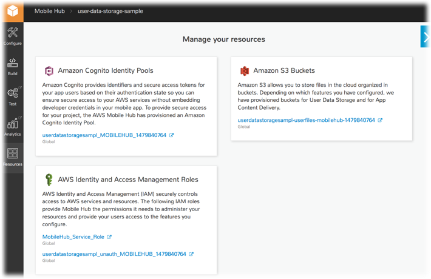

.. Copyright 2010-2018 Amazon.com, Inc. or its affiliates. All Rights Reserved.

   This work is licensed under a Creative Commons Attribution-NonCommercial-ShareAlike 4.0
   International License (the "License"). You may not use this file except in compliance with the
   License. A copy of the License is located at http://creativecommons.org/licenses/by-nc-sa/4.0/.

   This file is distributed on an "AS IS" BASIS, WITHOUT WARRANTIES OR CONDITIONS OF ANY KIND,
   either express or implied. See the License for the specific language governing permissions and
   limitations under the License.

.. _user-data-storage:

#################
User File Storage
#################

.. meta::
   :description: Use User File Storage mobile backend feature to add cloud storage of user files,
      profile data, and app state to your mobile app. Use the simple programming model of this
      feature to enable sync and caching of data between devices.

.. list-table::
   :widths: 1

   * - **Looking for the AWS SDKs for iOS and Android?** These SDKs and their docs are now part of `AWS Amplify <https://amzn.to/am-amplify-docs>`__.

       The content on this page applies only to apps that were configured using AWS Mobile Hub or awsmobile CLI. For existing apps that use AWS Mobile SDK prior to v2.8.0, we highly recommend you migrate your app to use `AWS Amplify <https://amzn.to/am-amplify-docs>`__ and the latest SDK.

Choose |AMHlong| User File Storage to:

* Add cloud storage of user files, profile data, and app state to your mobile app

* Use fine-grained control of access to files and data, implementing four common patterns of
  permissions policy

.. list-table::
   :widths: 1 6

   * - Looking for Amazon Cognito Sync?

     - Amazon Cognito Sync has been deprecated. For real time data sync between devices, with built-in offline capabilities, see `AWS AppSync <https://aws.amazon.com/appsync/>`__.

`Create a free Mobile Hub project and add the User File Storage
feature. <https://console.aws.amazon.com/mobilehub/home#/>`__

.. _user-data-storage-details:

Feature Details
===============

The Mobile Hub User File Storage feature, creates and configures four folders for each user, inside
an |S3long| (|S3|) bucket belonging to the app.

Best practice for app security is to allow the minimum access to your buckets that will support your
app design. Each of the four folders provisioned has a policy illustrating different permissions
choices attached. In addition, |AMH| provides the option to restrict access to your app to only
authenticated users using the :ref:`user-sign-in` feature.

:emphasis:`Note:` If you do not make the :ref:`user-sign-in` feature :guilabel:`Required` then,
where not blocked by a folder or bucket access policy, unauthenticated users will have access to
read and/or write data.

The following table shows the details of permissions policies that are provisioned for each folder
type.

.. list-table::
   :header-rows: 1
   :widths: 1 1 1

   * - :guilabel:`Folder name`

     - :guilabel:`Owner permissions`

     - :guilabel:`Everyone else permissions`

   * - Public

     - Read/Write

     - Read/Write

   * - Private

     - Read/Write

     - None

   * - Protected

     - Read/Write

     - Read Only

   * - Uploads

     - Write Only

     - Write Only

The following image shows IAM policy being applied to control file access in a Protected folder. The
policy grants read/write permissions for the user who created the folder, and read only permissions
for everyone else.

.. image:: images/diagram-abstract-user-data-storage-folders.png

The User File Storage feature enables you to store user files such as photos or documents in the
cloud, and it also allows you to save user profile data in key/value pairs, such as app settings or
game state. When you select this feature, an `Amazon S3 <http://docs.aws.amazon.com/AmazonS3/latest/dev/Introduction.html>`__ bucket is created as
the place your app will store user files.

.. _user-data-storage-ataglance:

User File Storage At a Glance
=============================

.. list-table::
   :widths: 1 6

   * - **AWS services and resources configured**

     - - **Amazon S3 bucket**
         (see `Amazon S3 Getting Started Guide <http://docs.aws.amazon.com/AmazonS3/latest/gsg/>`__)

         `Concepts <http://docs.aws.amazon.com/AmazonS3/latest/dev/>`__ | `Console <https://console.aws.amazon.com/s3/>`__ | `Pricing <https://aws.amazon.com/s3/pricing/>`__

       |AMH|-enabled features use |COG| for authentication and |IAM| for authorization. For more information, see :ref:`User Sign-in <user-sign-in>`. For more information, see :ref:`resources-user-data-storage`.

   * - **Configuration options**

     - This feature enables the following configuration options mobile backend capabilities:

       - Store user files and app data using |S3|. When you enable User File Storage four folders are provisioned, each with a distinct access policy configuration:

         - :code:`private` - Each mobile app user can create, read, update, and delete their own files in this folder. No other app users can access this folder.

         - :code:`protected` - Each mobile app user can create, read, update, and delete their own files in this folder. In addition, any app user can read any other app user's files in this folder.

         - :code:`public` ? Any app user can create, read, update, and delete files in this folder.

   * - :guilabel:`Quickstart demo features`

     - This feature adds the following to a quickstart app generated by |AMH|:

       - File explorer for the app's S3 bucket allows the user to:

         - Upload and view files in any **Public** folder.
         - View and download files in a **Private** folder that the user created.
         - View and download files in a **Protected** folder anyone created and upload files to that folder if the user created it.
         - Upload files to any **Uploads** folder. User setting of choice of color theme can be persisted to and retrieves from the cloud.

.. _resources-user-data-storage:

Viewing AWS Resources Provisioned for this Feature
==================================================

The following image shows the |AMH| :guilabel:`Resources` pane displaying elements typically
provisioned for the User File Storage feature.

