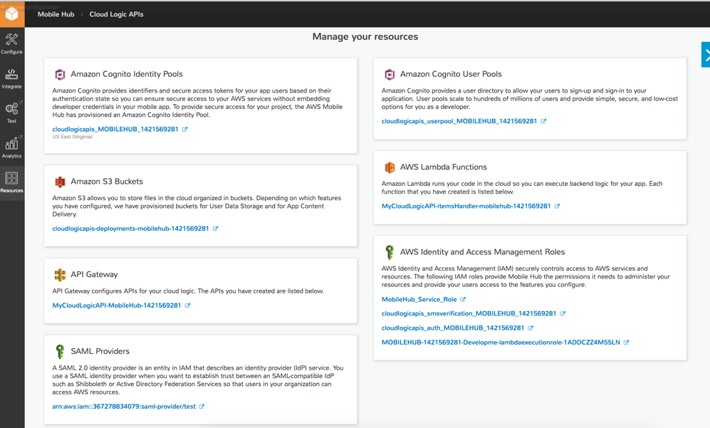

.. Copyright 2010-2018 Amazon.com, Inc. or its affiliates. All Rights Reserved.

   This work is licensed under a Creative Commons Attribution-NonCommercial-ShareAlike 4.0
   International License (the "License"). You may not use this file except in compliance with the
   License. A copy of the License is located at http://creativecommons.org/licenses/by-nc-sa/4.0/.

   This file is distributed on an "AS IS" BASIS, WITHOUT WARRANTIES OR CONDITIONS OF ANY KIND,
   either express or implied. See the License for the specific language governing permissions and
   limitations under the License.

.. _user-sign-in:

############
User Sign-in
############

.. meta::
   :description: Use the User Sign-in mobile backend as a service feature to add AWS user
      authentication and identity access management to your mobile app.

Choose the |AMHlong| User Sign-in mobile backend feature to:

* Add AWS user authentication and secure identity access management to your mobile app.

  :subscript:`Note: Secure unauthenticated access to AWS resources is available to all Mobile Hub
  projects with or without the User Sign-in feature.`

* Enable your users to sign-in to access AWS resources with existing credentials from identity
  providers like Facebook, Google, Microsoft Active Directory Federation Services or your own custom
  user directory.

`Create a free Mobile Hub project and add the User Sign-in feature.
<https://console.aws.amazon.com/mobilehub/home#/>`_

.. _user-sign-in-details:

Feature Details
===============

The following image shows a resource access policy being enforced for an unauthenticated user.

.. image:: images/diagram-abstract-user-sign-in-unauth.png

The following image shows a resource access policy being enforced for an authenticated user.

.. image:: images/diagram-abstract-user-sign-in-auth.png

This feature enables you to configure how your users gain access to AWS resources and services used
by your app, either with no sign in process or through authentication provided by one or more
identity providers. In both cases, AWS identity creation and credentials are provided by `Amazon
Cognito Identity <https://aws.amazon.com/cognito/dev-resources/>`_, and access authorization comes through `AWS Identity
and Access Management (IAM) <https://aws.amazon.com/iam/details/>`_.

When you create a project, |AMH| provisions the AWS identity, user role, and access policy
configuration required to allow all users access to unrestricted resources. When you add the User
Sign-in feature to your app, you are able to restrict access to allow only those who sign in with
credentials validated by an identity provider to use protected resources. Through |COGID|, your app
user obtains AWS credentials to directly access the AWS services that you enabled and configured for
your |AMH| project. Both authenticated and unauthenticated users are granted temporary,
limited-privilege credentials with the same level of security enforcement.

|COG| can federate validated user identities from multiple identity providers to a single AWS
identity. |AMH| helps you integrate identity providers into your mobile app so that users can sign
in using their existing credentials from Facebook, Google, and your own identity system. You can
also create and configure your own email- and password-based user directory using |COG| Your User
Pools.

.. _user-sign-in-ataglance:

User Sign-in Feature At a Glance
================================

.. list-table::
   :widths: 1 6

   * - **AWS services and resources configured**

     - - **Amazon Cognito**

         `Concepts <http://docs.aws.amazon.com/cognito/latest/developerguide/concepts.html>`_ | `Console <https://console.aws.amazon.com/cognito/federated/>`_ | `Pricing <https://aws.amazon.com/cognito/pricing/>`_

         - :guilabel:`Amazon Cognito Identity Pool`

           (see `Using Federated Identities <http://docs.aws.amazon.com/cognito/latest/developerguide/cognito-identity.html>`_)

         - :guilabel:`Amazon Cognito Your User Pools`

           (see `Creating and Managing User Pools <http://docs.aws.amazon.com/cognito/latest/developerguide//cognito-user-identity-pools.html>`_)

         - :guilabel:`Amazon Cognito SAML Federation`

           (see `Overview of Configuring SAML 2.0-Based Federation <http://docs.aws.amazon.com/IAM/latest/UserGuide/id_roles_providers_saml.html#CreatingSAML-configuring-IdP>`_)

       - **IAM role and security policies** (see :ref:`reference-mobile-hub-iam-managed-policies`)

         `Concepts <http://docs.aws.amazon.com/IAM/latest/UserGuide/>`_ | `Console <https://console.aws.amazon.com/iam/home#roles>`_ | `Pricing <http://docs.aws.amazon.com/IAM/latest/UserGuide/introduction.html#intro-features>`_

       For more information, see :ref:`resources-user-sign-in`.

   * - **Configuration options**

     - This feature enables the following mobile backend capabilities:

       :guilabel:`Sign-in Providers` (users gain greater access when they sign in)

       - via :guilabel:`Google` authentication (see :ref:`auth-setup`)

       - via :guilabel:`Facebook` authentication (see :ref:`auth-setup`)

       - via :guilabel:`Email and Password` authentication (see :ref:`user-sign-in-provider`)

       - via :guilabel:`SAML Federation` authentication (see :ref:`user-sign-in-provider`)

       :guilabel:`Required Sign-in` (authenticated access)

       :guilabel:`Optional Sign-in` (users gain greater access when they sign in) For more information, see :ref:`config-user-sign-in`

   * - :guilabel:`Quickstart demo features`

     - This feature adds the following to a quickstart app generated by |AMH|:

       - Unauthenticated access (if allowed by your app's configuration), displaying the ID that AWS assigns to the app instance's device.

       - Sign-in screen that authenticates users using the selected method: Facebook, Google, or Email and Password (your own user pool).

       - With :guilabel:`Optional Sign-in` and :guilabel:`Require Sign-in`, the app demonstrates an access barrier to protected folders for unauthenticated users.

.. _config-user-sign-in:

Configuring User Sign-in
========================

The following options are available for configuring your users' sign-in experience.

.. _user-sign-in-provider:

User Sign-in Providers
----------------------

Facebook

  - To enable Facebook user authentication, register your application with Facebook.

    If you already have a registered Facebook app, copy the App ID from the Facebook Developers App Dashboard. Paste the ID into the Facebook App ID field and choose Save Changes.

    If you do not have a Facebook App ID yet, you'll need to create one before you can integrate Facebook in your mobile app. The Facebook Developers portal takes you through the process of setting up your Facebook application.

    For full instructions on integrating your application with Facebook, see :ref:`Setting Up Facebook Authentication <auth-setup>`.

Google

  - To authenticate your users through Google, fully integrate your sample app with Google+ Sign-in.

    If you already have a registered Google Console project with the Google+ API, a web application OAuthClient and a client ID for the platform of your choice set up, then copy and paste the Google Web App Client ID and client ID(s) from the Google Developers Console into those fields and choose :guilabel:`Save Changes`.

    Regardless of the platform you choose (Android or iOS), you'll need to at least create the following.

        - A Google Console project with the Google+ API enabled (used for Google Sign-in)

        - A web application OAuth client ID

        - An iOS and/or Android client ID, depending on which platform you are supporting

    For full instructions on integrating your application with Google+, see `Setting Up Google Authentication <auth-google-setup>`.

Email and Password

  - Choose Email and Password sign-in when you want to create your own AWS-managed user directory and sign-in process for your app's users. Configure the characteristics of their sign-in experience by:

        - Selecting user login options (:emphasis:`email, username, and/or phone number`)

        - Enabling multi-factor authentication (:emphasis:`none, required, optional`) which adds      delivery of an entry code via text message to a user's phone, and a prompt to enter that code along with the other factor to sign-in

        - Selecting password character requirements (:emphasis:`minimum length, upper/lower cases, numbers or special characters allowed`).

SAML Federation

  - SAML Federation enables users with credentials in your existing identity store to sign in to your mobile app using their familiar username and password. A user signs into to your identity provider (IdP) which is configured to return a validating SAML assertion. Your app then uses Amazon Cognito Federated Identities to exchange the SAML assertion for typical temporary, limited privilege credentials to access your AWS backend services.

    SAML 2.0 (Security Assertion Markup Language 2.0) is an open standard used by many IdPs, including Microsoft Active Directory Federation Service and Shibboleth. Your IdP must be SAML 2.0 compatible to use this Mobile Hub option. To establish federation between AWS and your IdP the two systems must exchange SAML federation metadata. AWS federation metadata can be found at `https://signin.aws.amazon.com/static/saml-metadata.xml <https://signin.aws.amazon.com/static/saml-metadata.xml>`_. This xml file demonstrates the form that your IdP's metadata should take. For more information on SAML federation metadata for your IdP, see `Integrating Third-Party SAML Solution Providers with AWS <http://docs.aws.amazon.com/IAM/latest/UserGuide/id_roles_providers_saml_3rd-party.html>`_.

    To implement this exchange, view your IdP's documentation to understand how to use the AWS federation metadata file to register AWS as a service provider. Then provide upload your IdP's federation metadata file using SAML Federation page of the Mobile Hub console.

    To learn more about how AWS supports SAML federation, see `Overview of Configuring SAML 2.0-Based Federation <http://docs.aws.amazon.com/cognito/latest/developerguide/cognito-identity.html>`_.

.. _user-sign-in-requirement:

User Sign-in Requirement
------------------------

Sign-in is optional

  - Users have the option to sign in (authenticate) with your chosen sign-in identity provider(s) or users can skip sign-in (unauthenticated). Your app receives temporary, limited privilege access credentials from Amazon Cognito Identity as either an authenticated user or an unauthenticated guest user so that your app can access your AWS services securely.

Sign-in is required

  - Users are required to sign in with one of your chosen sign-in providers. Your app receives temporary, limited privilege access credentials from Amazon Cognito Identity as an authenticated user so that your app can access your AWS services securely.

.. note:: If user sign-in is not required, unauthenticated users can access to data in your database
   tables and files in your storage buckets, unless those resources are explicitly restricted
   through another mechanism.

.. _user-sign-in-iam:

User Sign-in and |IAMlong| (|IAM|)
----------------------------------

When your mobile app is saved, |AMH| creates an |COGlong| identity pool and a new |IAM| role. These
are used to generate temporary AWS credentials for the quickstart app users to access your AWS
resources. The AWS |IAM| role security policies are updated based on the sign-in features enabled.

At this point, your mobile project is set up for users to sign in. Each chosen identity provider has
been added to the login screen of the quickstart app.

For more information, see :ref:`reference-mobile-hub-iam-managed-policies`.

.. _resources-user-sign-in:

Viewing AWS Resources Provisioned for this Feature
==================================================

The following image shows the |AMH| :guilabel:`Resources` pane displaying elements typically
provisioned for the User Sign-in feature.

.. _quickstart-user-sign-in:

Quickstart App Details
======================

In the |AMH| quickstart app, the User Sign-in demo enables users to use features that access AWS
resources without authentication or by signing in to the app via identity providers including
Facebook, Google, SAML Federation or Email and Password.

When you add User Sign-in to your project with the :guilabel:`Optional Sign-in` option, choosing the
app's quickstart sign-in demo returns and displays the user's |COG| Identity Pool ID. This
identifier is associated with the app instance's device currently accessing AWS resources.

When you add User Sign-in to your project with :guilabel:`Required Sign-in`, choosing the app's
quickstart sign-in demo displays a sign-in experience branded to match the identity provider(s)
configured in the project. Signing in to the demo authenticates the user in the selected identity
provider service and returns and displays the |COG| Identity Pool ID identifier of the user.

