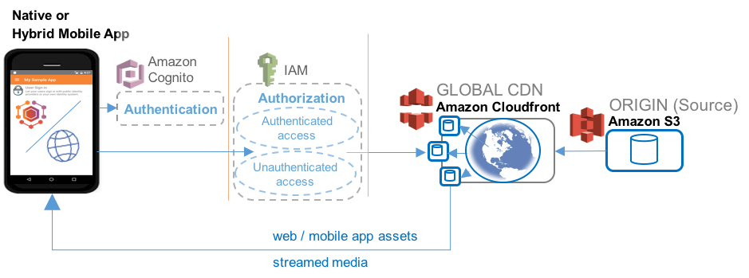

.. Copyright 2010-2018 Amazon.com, Inc. or its affiliates. All Rights Reserved.

   This work is licensed under a Creative Commons Attribution-NonCommercial-ShareAlike 4.0
   International License (the "License"). You may not use this file except in compliance with the
   License. A copy of the License is located at http://creativecommons.org/licenses/by-nc-sa/4.0/.

   This file is distributed on an "AS IS" BASIS, WITHOUT WARRANTIES OR CONDITIONS OF ANY KIND,
   either express or implied. See the License for the specific language governing permissions and
   limitations under the License.

.. _hosting-and-streaming:

#####################
Hosting and Streaming
#####################

.. meta::
   :description: Use the Hosting and Streaming mobile backend as a service feature to host web app
      and mobile app content, and distribute it to browsers, mobile web apps and native apps via a
      global CDN.

Choose |AMHlong| Hosting and Streaming to:

* Host content for you mobile web, native mobile or hybrid app

* Distribute your content through a global Content Delivery Network (CDN)

* Stream your media

`Create a free Mobile Hub project with Hosting and Streaming. Get a
custom sample app and SDK. <https://console.aws.amazon.com/mobilehub/home#/>`__

.. _hosting-and-streaming-details:

Feature Details
===============

The Hosting and Streaming feature delivers content through a global network of endpoints using
`Amazon Simple Storage Service (Amazon S3) <https://aws.amazon.com/s3/>`__ and `Amazon CloudFront <https://aws.amazon.com/cloudfront/>`__.

The following image shows how website assets and streaming media are distributed to a mobile web app
or browser. The web app is shown requesting AWS credentials and accessing AWS services through the
`AWS SDK for JavaScript
<http://docs.aws.amazon.com/sdk-for-javascript/v2/developer-guide/welcome.html>`__.

.. image:: images/diagram-abstract-hosting-and-streaming.png

The following image shows a native or hybrid mobile app requesting AWS credentials to access content
from a CDN edge location.

The Hosting and Streaming feature enables you to host website and app assets in the cloud, such as
HTML, JavaScript, image, or media files. Mobile Hub creates a content source storage location
(origin) using an `Amazon S3 <https://aws.amazon.com/documentation/s3/>`__ bucket. The bucket is made
accessible to the internet through the |S3| ability to statically host web content with no web
server.

Low latency access to your content is provided to users in all regions by caching your source
content on a global network of edge locations. This Content Distribution network (CDN) is provided
through an `Amazon CloudFront <https://aws.amazon.com/cloudfront/>`__ distribution which also supports media file streaming
(see `Amazon CloudFront streaming <https://aws.amazon.com/cloudfront/streaming/>`__).

.. _hosting-and-streaming-ataglance:

Hosting and Streaming At a Glance
=================================

.. list-table::
   :widths: 1 6

   * - **AWS services and resources configured**

     - - :guilabel:`Amazon CloudFront - Content Delivery Network` (see `Amazon CloudFront <http://docs.aws.amazon.com/AmazonCloudFront/latest/DeveloperGuide/>`__)

         `Concepts <http://docs.aws.amazon.com/AmazonCloudFront/latest/DeveloperGuide/HowCloudFrontWorks.html>`__ | `Console <https://console.aws.amazon.com/cloudfront/>`__ | `Pricing <https://aws.amazon.com/cloudfront/pricing/>`__

       - :guilabel:`Amazon S3 Bucket` (see `Amazon S3 Getting Started Guide` <https://aws.amazon.com/cloudfront/pricing/>`__)

         `Concepts <http://docs.aws.amazon.com/AmazonS3/latest/dev/>`__ | `Console <https://console.aws.amazon.com/s3/>`__ | `Pricing <https://aws.amazon.com/s3/pricing/>`__

       |AMH|-enabled features use |COG| for authentication and |IAM| for authorization. For more information, see :ref:`User Sign-in <user-sign-in>`.

       For more information, see :ref:`resources-hosting-and-streaming`.

   * - **Configuration options**

     - This feature enables the following mobile backend capabilities:

       - **Web app content hosting** (Internet access for your content, no web servers required)
       - **AWS SDK for JavaScript** (Call AWS services via standard scripting)
       - **Global CDN** (Global content distribution and media streaming) |CF| offers several options for regional scope and cost of your distribution. For more information, see :ref:`config-hosting-and-streaming`.

   * - **Web app demo**

     - Sample

       - The AWS SDK for Javascript and a custom-generated configuration file are provisioned to your bucket.

       For more information, see :ref:`webapp-hosting-and-streaming`.

   * - :emphasis:`Quickstart native app demos`

     - This feature adds the following to a quickstart app generated by |AMH|:

       - View file list in AWS storage, download and view files, and manage their local cache.

.. _webapp-hosting-and-streaming:

Web App Support
===============

When you enable Hosting and Streaming, Mobile Hub provisions a local copy of the `AWS SDK for
JavaScript <http://docs.aws.amazon.com/sdk-for-javascript/v2/developer-guide/welcome.html>`__ in the
root of your bucket.

Mobile Hub also generates the project configuration files :code:`aws-config.js` and
:code:`aws-exports.js`, which contain endpoint constants for each AWS services Mobile Hub configured
for your project. :code:`aws-exports.js` is provided for integration with ES6 compatible scripting
languages like Node.js. Use these values to make SDK calls to your services from your hosted web
app.

.. note:: Best security practice is to reduce access to an app's resources as much as possible.
   These configuration files are publically accessible and contain identifiers for all of your app's
   AWS resources. If it suits your design, we recommend you protect your resources by allowing only
   authenticated users to access them. You can do this in this project by enabling the Mobile Hub
   :ref:`user-sign-in` with the :guilabel:`Require sign-in` option.

You can also copy the appropriate configuration file into your hybrid native/web mobile app to
enable calling your AWS services from your app using JavaScript.

.. _config-hosting-and-streaming:

Configuring the Hosting and Streaming Feature
=============================================

.. contents::
   :local:
   :depth: 1

.. _browse-hosting-and-streaming:

Browsing Your Content
---------------------

With Hosting and Streaming enabled, you have several options:

* :guilabel:`Launch from Amazon S3`: This option browses to the un-cached index.html in the root of
  your source bucket.

* :guilabel:`Launch from Amazon CloudFront`: This option browses to the index.html that is cached on
  the CDN edge servers.

  .. note:: Provisioning the edge locations for the distribution can take up to an hour. This link
     will not resolve until the distribution finishes propagating in the network.

* :guilabel:`Manage files`: This option opens the |S3| console to review and manage the contents of
  your source bucket. You can also find your bucket in the |S3| console by opening your project in
  |AMH| and then choosing the :guilabel:`Resources` icon on the left. The name of the bucket
  configured for Hosting and Streaming contains the string :code:`hosting`.

.. _managing-hosting-and-streaming:

Managing Your App Assets
------------------------

You can choose from a variety of ways to manage your web app assets through use of the Amazon S3
console, the AWS Command Line Interface (CLI) or one of the many third party applications available.

.. _console-hosting-and-streaming:

Using the Amazon S3 Console
~~~~~~~~~~~~~~~~~~~~~~~~~~~

To use the |S3| console to review, upload, move or delete your files stored in your bucket, navigate
to the `Amazon S3 console <https://console.aws.amazon.com/s3/home>`__ and choose the bucket whose
name contains your project name. Your web app content will reside in the root folder.

.. _cli-hosting-and-streaming:

Using AWS CLI
~~~~~~~~~~~~~

AWS CLI allows you to review, upload, move or delete your files stored in your bucket using the
command line.

To install and configure the AWS CLI client, see `Getting Set Up with the AWS Command Line Interface
<https://docs.aws.amazon.com/cli/latest/userguide/cli-chap-getting-set-up.html>`__.

As an example, the sync command enables transfer of files to and from your local folder
(:code:`source`) and your bucket (:code:`destination`).

:code:`$ aws s3 sync {source destination} [--options]`

The following command syncs all files from your current local folder to the folder in your web app's
bucket defined by :code:`path`.

:code:`$ aws s3 sync . s3://my-web-app-bucket/path`

To learn more about using AWS CLI to manage Amazon S3, see `Using Amazon S3 with the AWS Command
Line Interface <https://docs.aws.amazon.com/cli/latest/userguide/cli-s3.html>`__

.. _domains-hosting-and-streaming:

Using a Custom Domain for Your Web App
--------------------------------------

To configure your Hosting and Streaming CDN as the destination of your custom domain, see `Routing
Traffic to an Amazon CloudFront Web Distribution by Using Your Domain Name
<http://docs.aws.amazon.com/Route53/latest/DeveloperGuide/routing-to-cloudfront-distribution.html>`__.

.. _resources-hosting-and-streaming:

Viewing AWS Resources Provisioned for this Feature
==================================================

The following image shows the |AMH| :guilabel:`Resources` pane displaying elements typically
provisioned for the Hosting and Streaming feature.

.. image:: images/resources-hosting-and-streaming.png

.. _hosting-and-streaming-quickstart:

Quickstart App Details
======================

In the |AMH| quickstart app, the Hosting and Streaming demo lists a set of image files that can be
downloaded and cached locally and displayed on the device. The user can also delete the local copy
of the image files.

