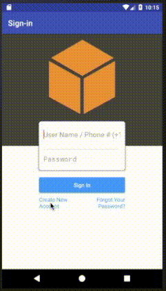

.. Copyright 2010-2018 Amazon.com, Inc. or its affiliates. All Rights Reserved.

   This work is licensed under a Creative Commons Attribution-NonCommercial-ShareAlike 4.0
   International License (the "License"). You may not use this file except in compliance with the
   License. A copy of the License is located at http://creativecommons.org/licenses/by-nc-sa/4.0/.

   This file is distributed on an "AS IS" BASIS, WITHOUT WARRANTIES OR CONDITIONS OF ANY KIND,
   either express or implied. See the License for the specific language governing permissions and
   limitations under the License.

.. _tutorial-android-aws-mobile-notes-auth:

###################################
Add Authentication to the Notes App
###################################

In the :ref:`previous section <tutorial-android-aws-mobile-notes-analytics>` of this tutorial, we created a mobile backend project in AWS Mobile Hub, then added analytics to the sample note-taking app. This section assumes you have completed those steps. If you jumped to this step, please go back and :ref:`start from
the beginning <tutorial-android-aws-mobile-notes-setup>`. In this tutorial, we will configure a sign-up / sign-in flow in our mobile backend. We will then add a new authentication activity to our note-taking app.

You should be able to complete this section of the tutorial in 20-30 minutes.

Set Up Your Backend
-------------------

Before we work on the client-side code, we need to add User Sign-in to
the backend project:

#. Open the `AWS Mobile Hub console <https://console.aws.amazon.com/mobilehub/home/>`__.
#. Select your project.
#. Scroll down to the :guilabel:`Add More Backend Features` section.
#. Choose the :guilabel:`User Sign-in` tile.
#. Choose :guilabel:`Email and Password`.
#. Select the :guilabel:`Username` radio button and the :guilabel:`Phone` checkbox under it.
#. Select **Required** for :guilabel:`Multi-factor authentication`.
#. At the bottom of the page, set the :guilabel:`Require user sign-in?` switch to :guilabel:`YES`.

    .. list-table::
       :widths: 1 6

       * - What does this do?

         - You have just created your own user pool in the `Amazon Cognito <https://docs.aws.amazon.com/cognito/latest/developerguide/cognito-user-identity-pools.html>`__ service. When used in conjunction with the AWS Mobile sign-in process, the user pool enforces the password requirement rules you chose. It also supports sign-up and forgot my password user flows.

#. Choose your project name in the upper left and then choose :guilabel:`Integrate` on your Android app card.
#. Choose :guilabel:`Download Cloud Config` to get an  :file:`awsconfiguration.json` file updated with the new services.
#. Choose :guilabel:`Next` and then choose :guilabel:`Done`.

.. list-table::
   :widths: 1 6

   * - **Remember**

     - Whenever you update the AWS Mobile Hub project, a new AWS configuration file for your app is generated.

Connect to Your Backend
-----------------------

Replace the :file:`awsconfiguration.json` file in :file:`app/src/main/res/raw` directory with the updated version.

.. list-table::
   :widths: 1 6

   * - **Note**

     - Your system may have modified the filename to avoid conflicts. Make sure the file you add to your Xcode project is named :file:`awsconfiguration.json`.

Add the Authentication UI Library
---------------------------------

#. Open the :file:`app/build.gradle` file and add the following lines to the :code:`dependencies` section:

    .. code-block:: java

       dependencies {
          compile fileTree(dir: 'libs', include: ['*.jar'])
          implementation 'com.android.support:appcompat-v7:26.1.0'
          implementation 'com.android.support:support-v4:26.1.0'
          implementation 'com.android.support:cardview-v7:26.1.0'
          implementation 'com.android.support:recyclerview-v7:26.1.0'
          implementation 'com.android.support.constraint:constraint-layout:1.0.2'
          implementation 'com.android.support:design:26.1.0'
          implementation 'com.android.support:multidex:1.0.1'
          implementation 'joda-time:joda-time:2.9.9'

          //AWS Mobile SDK for Android
          implementation 'com.amazonaws:aws-android-sdk-core:2.6.+'
          implementation 'com.amazonaws:aws-android-sdk-auth-core:2.6.+@aar'
          implementation 'com.amazonaws:aws-android-sdk-auth-ui:2.6.+@aar'
          implementation 'com.amazonaws:aws-android-sdk-auth-userpools:2.6.+@aar'
          implementation 'com.amazonaws:aws-android-sdk-cognitoidentityprovider:2.6.+'
          implementation 'com.amazonaws:aws-android-sdk-pinpoint:2.6.+'
        }

#. Choose :guilabel:`Sync Now` on the upper right to incorporate the dependencies you just declared.

Register the Email and Password Sign-in Provider
------------------------------------------------

The sign-in UI is provided by :code:`IdentityManager`. Each method of
establishing identity (email and password, Facebook and Google) requires
a plug-in provider that handles the appropriate sign-in flow.

1. Open your project in Android Studio.
2. Open the :code:`AWSProvider.java` class.
3. Add the following to the import declarations:

   .. code-block:: java

      import com.amazonaws.auth.AWSCredentialsProvider;
      import com.amazonaws.mobile.auth.core.IdentityManager;
      import com.amazonaws.mobile.auth.userpools.CognitoUserPoolsSignInProvider;
      import com.amazonaws.mobile.config.AWSConfiguration;
      import com.amazonaws.mobileconnectors.pinpoint.PinpointConfiguration;
      import com.amazonaws.mobileconnectors.pinpoint.PinpointManager;

4. Adjust the constructor to add the :code:`CognitoUserPoolsSignInProvider`.

   .. code-block:: java

      private AWSProvider(Context context) {
         this.context = context;
         this.awsConfiguration = new AWSConfiguration(context);

         IdentityManager identityManager = new IdentityManager(context, awsConfiguration);
         IdentityManager.setDefaultIdentityManager(identityManager);
         identityManager.addSignInProvider(CognitoUserPoolsSignInProvider.class);
      }

Add a AuthenticatorActivity to the project
------------------------------------------

You can call the IdentityProvider at any point in your application. In
this tutorial, we will add a new screen to the project that is displayed
before the list. The user will be prompted to sign-up or sign-in prior
to seeing the list of notes. This ensures that all connections to the
backend will be authenticated.

**To add a AuthenticatorActivity to the project, in Android Studio**

1. Right-click the :file:`com.amazonaws.mobile.samples.mynotes` folder.
2. Choose :guilabel:`New > Activity > Empty Activity`.
3. Type :userinput:`AuthenticatorActivity` as the :guilabel:`Activity Name`.
4. Choose :guilabel:`Finish`.

Edit the :code:`onCreate()` method of :file:`AuthenticatorActivity.java` as follows:

  .. code-block:: java

      @Override
      protected void onCreate(Bundle savedInstanceState) {
          super.onCreate(savedInstanceState);
          setContentView(R.layout.activity_authenticator);

          final IdentityManager identityManager = AWSProvider.getInstance().getIdentityManager();
          // Set up the callbacks to handle the authentication response
          identityManager.login(this, new DefaultSignInResultHandler() {
              @Override
              public void onSuccess(Activity activity, IdentityProvider identityProvider) {
                  Toast.makeText(AuthenticatorActivity.this,
                          String.format("Logged in as %s", identityManager.getCachedUserID()),
                          Toast.LENGTH_LONG).show();
                  // Go to the main activity
                  final Intent intent = new Intent(activity, NoteListActivity.class)
                          .setFlags(Intent.FLAG_ACTIVITY_CLEAR_TOP);
                  activity.startActivity(intent);
                  activity.finish();
              }

              @Override
              public boolean onCancel(Activity activity) {
                  return false;
              }
          });

          // Start the authentication UI
          AuthUIConfiguration config = new AuthUIConfiguration.Builder()
                  .userPools(true)
                  .build();
          SignInActivity.startSignInActivity(this, config);
          AuthenticatorActivity.this.finish();
      }

 .. list-table::
   :widths: 1 6

   * - What does this do?

     - The AWS SDK for Android contains an in-built activity for handling the authentication UI.  This Activity sets up the authentication UI to work for just email and password, then sets up an activity listener to handle the response.  In this case, we transition to the :code:`NoteListActivity` when a successful sign-in occurs, and stay on this activity when it fails. Finally, we transition to the Sign-In activity from the AWS SDK for Android library.

Update the AndroidManifest.xml
------------------------------

The :code:`AuthenticatorActivity` will be added to the :file:`AndroidManifest.xml`
automatically, but it will not be set as the default (starting)
activity. To make the AuthenticatorActivity primary, edit the
:file:`AndroidManifest.xml`:

  .. code-block:: xml

     <activity
         android:name=".AuthenticatorActivity"
         android:label="Sign In"
         android:theme="@style/AppTheme.NoActionBar">
         <intent-filter>
             <action android:name="android.intent.action.MAIN" />
             <category android:name="android.intent.category.LAUNCHER" />
         </intent-filter>
     </activity>
     <activity
         android:name=".NoteListActivity"
         android:label="@string/app_name"
         android:theme="@style/AppTheme.NoActionBar">
         <!-- Remove the intent-filter from here -->
     </activity>

The :code:`.AuthenticatorActivity` section is added at the end. Ensure it is not
duplicated. You will see build errors if the section is duplicated.

Run the project and validate results
------------------------------------

Run in the emulator using :guilabel:`Run` > :guilabel:`Run 'app'`. You should see a sign-in
screen. Choose the :guilabel:`Create new account` button to create a new account.
Once the information is submitted, you will be sent a confirmation code
via email. Enter the confirmation code to complete registration, then
sign-in with your new account.

.. list-table::
   :widths: 1 6

   * - **Tip**

     - Use Amazon WorkMail as a test email account

       If you do not want to use your own email account as a test account, create an
       `Amazon WorkMail <https://aws.amazon.com/workmail/>`__ service within AWS for test accounts. You can get started for free with a 30-day trial for up to 25 accounts.

Next steps
----------

-  Continue by integrating :ref:`NoSQL Data <tutorial-android-aws-mobile-notes-data>`.

-  Learn more about `Amazon Cognito <https://aws.amazon.com/cognito/>`__.
