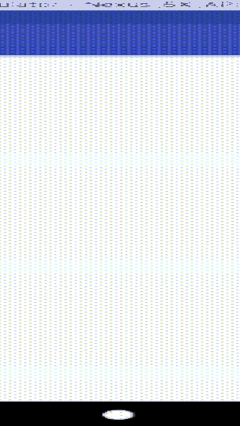

.. Copyright 2010-2018 Amazon.com, Inc. or its affiliates. All Rights Reserved.

   This work is licensed under a Creative Commons Attribution-NonCommercial-ShareAlike 4.0
   International License (the "License"). You may not use this file except in compliance with the
   License. A copy of the License is located at http://creativecommons.org/licenses/by-nc-sa/4.0/.

   This file is distributed on an "AS IS" BASIS, WITHOUT WARRANTIES OR CONDITIONS OF ANY KIND,
   either express or implied. See the License for the specific language governing permissions and
   limitations under the License.

.. _tutorial-android-aws-mobile-notes-setup:

########################
A Simple Note-taking App
########################

.. toctree::
   :titlesonly:
   :maxdepth: 1
   :hidden:

   Analytics <tutorial-android-aws-mobile-notes-analytics>
   Authentication <tutorial-android-aws-mobile-notes-auth>
   NoSQL Data <tutorial-android-aws-mobile-notes-data>

Start with a working app and then add cloud enabled features. In this tutorial you will take a working app, driven from locally stored data, and then:

- :ref:`Add analytics to your app <tutorial-android-aws-mobile-notes-analytics>` so you can view demographic information about your users.

- :ref:`Add a simple sign-in/sign-up flow <tutorial-android-aws-mobile-notes-analytics>` for authentication.

- :ref:`Access data stores in the AWS <tutorial-android-aws-mobile-notes-data>` cloud, so that a user's notes are available to them on any device with the app installed.

You should be able to complete the setup section of this tutorial within 10-15 minutes after
you have installed all required software. Once you complete the instructions on this page, you can run the project on your local system.

Getting Started
---------------

Before beginning, you must:

-  Download and install `Android Studio <https://developer.android.com/studio/index.html>`_ version 3.0.1 or later.

-  Download an install `Android SDK <https://developer.android.com/studio/intro/update.html#sdk-manager>`_ version 8.0 (Oreo), API level 26..

-  Install an `Android Emulator <https://developer.android.com/studio/run/managing-avds.html>`_ - the app works with both phone and tablet emulators (for example, the Nexus 5X or Pixel C).

Windows Specific Instructions
~~~~~~~~~~~~~~~~~~~~~~~~~~~~~

-  Install `Git for Windows <https://git-scm.com/download/win>`_.

Mac Specific Instructions
~~~~~~~~~~~~~~~~~~~~~~~~~

-  Install
   `XCode <https://itunes.apple.com/us/app/xcode/id497799835?mt=12>`__
   using the Mac App Store.

-  Configure the XCode command line tools. Run
   ``xcode-select --install`` from a Terminal window.

   .. list-table::
      :widths: 1

      * - Why do I need XCode?

          The XCode package includes command line tools that are used on a Mac to assist with software development. You don't need to run the UI XCode application.

Download the Source code
------------------------

1. Get the tutorial source code using one of the following choices:

   * Download the source code as a `ZIP file <https://github.com/aws-samples/aws-mobile-android-notes-tutorial/archive/master.zip>`_.

   * Browse to  `https://github.com/aws-samples/aws-mobile-android-notes-tutorial/ <https://github.com/aws-samples/aws-mobile-android-notes-tutorial/>`_ and clone or fork the repository (`sign up for GitHub account <https://github.com/join?source=header-home>`_, if you do not have one).

Compile the Source Code
-----------------------

To compile the source code:

1. Start :guilabel:`Android Studio`.
2. If you have a project open already, choose :guilabel:`File > Close Project`.
3. Choose :guilabel:`Open an existing Android Studio project`.
4. Find and choose the :guilabel:`aws-mobile-android-notes-tutorial-master` project in your file system, then choose :guilabel:`OK`.

   .. image:: images/open-project.png
      :scale: 100
      :alt: Find MyNotes folder in the Android Studio project explorer.

5. Select :guilabel:`Build > Make Project` from the menu bar.

The compilation step should complete with no errors. Errors are
displayed within the :guilabel:`Messages` window, available on the status bar at
the bottom of the project.

Run the Project in an Emulator
------------------------------

Create a new emulator if you have not done so already:

#. Select :guilabel:`Tools > Android > AVD Manager`.
#. Choose :guilabel:`Create Virtual Device....`
#. Select :guilabel:`Phone  > Nexus 5X`, then choose :guilabel:`Next`.
#. Select the :guilabel:`x86 Images` tab, then select :guilabel:`Android 8.0 (Google APIs)`.

   -  If you have not previously downloaded the image, you can download
      it from this screen.

#. Choose :guilabel:`Next`.
#. Choose :guilabel:`Finish`.
#. Close the AVD Manager.

Run the project in an emulator.

#. Select :guilabel:`Run` > :guilabel:`Run 'app'`.
#. Select the :guilabel:`Nexus 5X API 26` virtual device.
#. Choose :guilabel:`OK`.

The Android emulator will boot (if it is not already started) and the
application will run. You should be able to interact with the
application as you would any other mobile app. Try pressing on the :guilabel:`+` at
the bottom to create a note, or choose a note to show the editor
screen. A unique ID for each note is displayed in
the list view underneath the note's title.

Running into Problems
---------------------

The most common problems at this stage involve issues with the
installation of Java, Android Studio, the Android SDK or the Android
Emulator. Google provides detailed instructions on `Android Studio <https://developer.android.com/studio/index.html>`_ and
dependent features.

Next Steps
----------

Next, :ref:`integrate application analytics <tutorial-android-aws-mobile-notes-analytics>` into your project.

