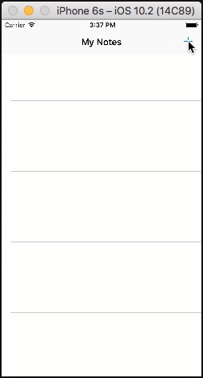

.. Copyright 2010-2018 Amazon.com, Inc. or its affiliates. All Rights Reserved.

   This work is licensed under a Creative Commons Attribution-NonCommercial-ShareAlike 4.0
   International License (the "License"). You may not use this file except in compliance with the
   License. A copy of the License is located at http://creativecommons.org/licenses/by-nc-sa/4.0/.

   This file is distributed on an "AS IS" BASIS, WITHOUT WARRANTIES OR CONDITIONS OF ANY KIND,
   either express or implied. See the License for the specific language governing permissions and
   limitations under the License.

.. _tutorial-ios-aws-mobile-notes-auth:

###################################
Add Authentication to the Notes App
###################################

In the :ref:`previous section <tutorial-ios-aws-mobile-notes-analytics>` of this tutorial, we created a mobile backend project in AWS Mobile Hub, then added analytics to the sample note-taking app. This section assumes you have completed those steps. If you jumped to this step, please go back and :ref:`start from
the beginning <tutorial-ios-aws-mobile-notes-setup>`. In this tutorial, we will configure a sign-up / sign-in flow in our mobile backend. We will then add a new authentication activity to our note-taking app.

You should be able to complete this section of the tutorial in 20-30 minutes.

Setup Your Backend
------------------

To add User Sign-in to your app you will create the backend resources in your |AMH| project, and then update the configuration file in your app.

Add User Sign-in to the AWS Mobile Hub Project
----------------------------------------------

#. Right-click :file:`awsconfiguration.json` in your Xcode Project Navigator, choose :guilabel:`Delete`, and then choose :guilabel:`Move to trash`.
#. Open the `AWS Mobile Hub console <https://console.aws.amazon.com/mobilehub/home/>`__.
#. Select your project.
#. Scroll down to the :guilabel:`Add More Backend Features` section.
#. Choose the :guilabel:`User Sign-in` tile.
#. Choose :guilabel:`Email and Password`.
#. Scroll to the bottom and then Choose :guilabel:`Create user pool`.

    .. list-table::
       :widths: 1 6

       * - What does this do?

         - You have just created your own user pool in the `Amazon Cognito <https://docs.aws.amazon.com/cognito/latest/developerguide/cognito-user-identity-pools.html>`__ service. When used in conjunction with the AWS Mobile sign-in process, the user pool enforces the password requirement rules you chose. It also supports sign-up and forgot my password user flows.

#. Choose your project name in the upper left and then choose :guilabel:`Integrate` on your iOS app card.
#. Choose :guilabel:`Download Cloud Config` to get an  :file:`awsconfiguration.json` file updated with the new services.

    .. list-table::
       :widths: 1 6

       * - **Remember**

         - Whenever you update the AWS Mobile Hub project, a new AWS configuration file for your app is generated.

Connect to Your Backend
-----------------------

To update the linkage between your app and your AWS services:

#. Drag :file:`awsconfiguration.json` from your download location into the Xcode project folder containing :file:`Info.plist`. Select :guilabel:`Copy items if needed` and :guilabel:`Create groups` in the options dialog. Choose :guilabel:`Finish`.

.. list-table::
   :widths: 1 6

   * - **Note**

     - Your system may have modified the filename to avoid conflicts. Make sure the file you add to your Xcode project is named :file:`awsconfiguration.json`.

Add Auth Dependencies
---------------------

#. Add the following Auth dependencies in your project's :file:`Podfile`

   .. code-block:: bash

      platform :ios, '9.0'
      target :'MyNotes' do
          use_frameworks!

            # Analytics dependency
            pod 'AWSPinpoint', '~> 2.6.5'

            # Auth dependencies
            pod 'AWSUserPoolsSignIn', '~> 2.6.5'
            pod 'AWSAuthUI', '~> 2.6.5'
            pod 'AWSMobileClient', '~> 2.6.5'

          # other pods
      end

   Then, in a terminal run:

   .. code-block:: bash

      pod install --repo-update

Create an AWSMobileClient and Initialize the SDK
------------------------------------------------

Import :code:`AWSMobileClient` and add the following function into the :code:`AppDelegate` class of :file:`AppDelegate.swift`. This will that an instance of :code:`AWSMobileClient`.

.. code-block:: swift

   import UIKit
   import CoreData

   // Anaytics imports
   import AWSCore
   import AWSPinpoint

   // Auth imports
   import AWSMobileClient

   @UIApplicationMain
   class AppDelegate: UIResponder, UIApplicationDelegate {

                  // . . .

       //Instantiate the AWSMobileClient
       func application(_ application: UIApplication, open url: URL,
           sourceApplication: String?, annotation: Any) -> Bool {

           return AWSMobileClient.sharedInstance().interceptApplication(
               application, open: url,
               sourceApplication: sourceApplication,
               annotation: annotation)

       }

                   // . . .
   }

In :code:`didFinishLaunching` call the :code:`AWSMobileClient` to register your user pool as the identity provider that enables users to access your app's AWS resources.

.. code-block:: swift

    func application(
        _ application: UIApplication,
        didFinishLaunchingWithOptions launchOptions:
        [UIApplicationLaunchOptionsKey: Any]?) -> Bool {

        // Initialize AWSMobileClient
        let didFinishLaunching = AWSMobileClient.sharedInstance().interceptApplication(
            application, didFinishLaunchingWithOptions:
            launchOptions)

        // Initialize Pinpoint to enable session analytics
        let pinpoint = AWSPinpoint(configuration:
            AWSPinpointConfiguration.defaultPinpointConfiguration(
                launchOptions: launchOptions))

        return didFinishLaunching
   }

.. list-table::
   :widths: 1 6

   * - What did this do?

     - This will register your sign in providers and fetch the user pool you created and fetch an identity that enables a user to access your app's AWS resources. In this case, the provider is an `Amazon Cognito user pool <https://docs.aws.amazon.com/cognito/latest/developerguide/cognito-user-identity-pools.html>`__, but federating Facebook, Google, SAML and other identity providers is also supported.

Implement Your Sign-in UI
-------------------------

The AWS Mobile SDK provides a library that creates a customizable sign-in UI in your app. To create your sign-in UI, add the following imports and then call the library in the :code:`viewDidLoad()` function of :file:`MasterViewController.swift`
.

.. code-block:: swift

    import AWSCore
    import AWSPinpoint
    import UIKit
    import AWSAuthCore
    import AWSAuthUI

    class MasterViewController: UITableViewController, NSFetchedResultsControllerDelegate {

               // . . .

        override func viewDidLoad() {
                super.viewDidLoad()

                // Instantiate sign-in UI from the SDK library
                if !AWSSignInManager.sharedInstance().isLoggedIn {
                    AWSAuthUIViewController
                        .presentViewController(with: self.navigationController!,
                             configuration: nil,
                             completionHandler: { (provider: AWSSignInProvider, error: Error?) in
                              if error != nil {
                                  print("Error occurred: \(String(describing: error))")
                              } else {
                                  // Sign in successful.
                              }
                        })
                }

               // . . .
          }
      }

Run the App and Validate Results
--------------------------------

Rebuild the project and run in the Simulator. You should see a sign-in
screen. Choose the :guilabel:`Create new account` button to create a new account.
Once the information is submitted, you will be sent a confirmation code
via email. Enter the confirmation code to complete registration, then
sign-in with your new account.

.. list-table::
   :widths: 1 6

   * - **Tip**

     - Use Amazon WorkMail as a test email account

       If you do not want to use your own email account as a test account, create an
       `Amazon WorkMail <https://aws.amazon.com/workmail/>`__ service within AWS for test accounts. You can get started for free with a 30-day trial for up to 25 accounts.

Next steps
----------

-  Continue by integrating :ref:`NoSQL Data <tutorial-ios-aws-mobile-notes-data>`.

-  Learn more about `Amazon Cognito <https://aws.amazon.com/cognito/>`__.
