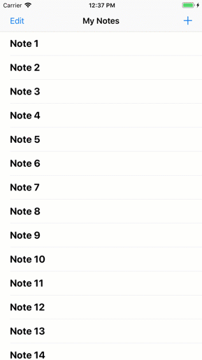

.. _tutorial-ios-aws-mobile-notes-setup:

########################
Tutorial: Create a Simple iOS Note-Taking App
########################

.. toctree::
   :titlesonly:
   :maxdepth: 1
   :hidden:

   Analytics <tutorial-ios-aws-mobile-notes-analytics>
   Authentication <tutorial-ios-aws-mobile-notes-auth>
   Serverless Backend <tutorial-ios-aws-mobile-notes-data>

Start with a working app and then add cloud enable features. In this tutorial, you take a working app, driven from locally stored data, and then do the following:

- :ref:`Add analytics to your app <tutorial-ios-aws-mobile-notes-analytics>`, so you can view demographic information about your users.

- :ref:`Add a simple sign-in/sign-up flow <tutorial-ios-aws-mobile-notes-auth>` for authentication.

- :ref:`Access data stores in the AWS  cloud<tutorial-ios-aws-mobile-notes-data>`, so that a users' notes are available to them on any device with the app installed.

You should be able to complete the setup section of this tutorial within 10-15 minutes after you have installed all required software. Once you complete the instructions on this page, you can run the project on your local system.

.. _ios-tutorial-notes-getting-started:

Getting Started
---------------

Before beginning, you must:

#. Complete the `Getting Started <https://aws-amplify.github.io/media/get_started>`__ instructions to install the Amplify CLI.
#. Install `Xcode <https://itunes.apple.com/us/app/xcode/id497799835?mt=12>`__ using the Mac App Store (version 9.0 or higher is required).
#. Configure the Xcode command line tools. Run ``xcode-select --install`` from a Terminal window.
#. Install `Cocoapods <https://cocoapods.org/>`__. From a terminal window run the following:

   .. code-block:: none

      sudo gem install cocoapods

Download the Source Code
------------------------

Download the `source code <https://github.com/aws-samples/aws-mobile-ios-notes-tutorial/>`__ as a `ZIP file <https://github.com/aws-samples/aws-mobile-ios-notes-tutorial/archive/master.zip>`__.

Compile and Run the Project
---------------------------

To compile the source code and run the project in a simulator:

#.  Unzip :file:`aws-mobile-ios-notes-tutorial-master.zip` and launch Xcode by choosing :file:`MyNotes.xcodeproj` in the expanded folder.
#.  Choose :guilabel:`Product > Build` (|Acommand|-B) to build the project.
#.  In the toolbar next to the label with your app name, choose any compatible simulator from the list.
#.  On the top left choose the run icon (|play|) or type |Acommand|-R to build and run the app.

You should be able to interact with the application. Try clicking on the :guilabel:`+` at the top right to create a note, or choose a note to show the editor screen.

Next Steps
----------

Next, :ref:`integrate application analytics <tutorial-ios-aws-mobile-notes-analytics>` into your project.

