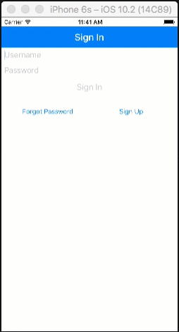

.. Copyright 2010-2018 Amazon.com, Inc. or its affiliates. All Rights Reserved.

   This work is licensed under a Creative Commons Attribution-NonCommercial-ShareAlike 4.0
   International License (the "License"). You may not use this file except in compliance with the
   License. A copy of the License is located at http://creativecommons.org/licenses/by-nc-sa/4.0/.

   This file is distributed on an "AS IS" BASIS, WITHOUT WARRANTIES OR CONDITIONS OF ANY KIND,
   either express or implied. See the License for the specific language governing permissions and
   limitations under the License.

.. _tutorial-android-aws-mobile-notes-auth:

###################################
Add Authentication to the Notes App
###################################

In the :ref:`previous section <tutorial-android-aws-mobile-notes-analytics>` of this tutorial, we created a mobile backend project in AWS Mobile Hub, installed AWS Amplify, and then added analytics to the sample note-taking app. This section assumes you have completed those steps. If you jumped to this step, please go back and :ref:`start from
the beginning <tutorial-android-aws-mobile-notes-setup>`. In this tutorial, we will configure a sign-up / sign-in flow in our mobile backend. We will then add a new authentication activity to our note-taking app.

You should be able to complete this section of the tutorial in 20-30 minutes.

Add User Sign-in to the AWS Mobile Hub project
----------------------------------------------

Before we work on the client-side code, we need to add User Sign-in to
the backend project:

#. Run :code:`awsmobile console` to open your project in the |AMH| console.
#. Scroll down until you see :guilabel:`Add More Backend Features`.
#. Choose the :guilabel:`User Sign-in` tile.
#. Choose :guilabel:`Email and Password`.
#. Scroll to the bottom of the page, then Choose :guilabel:`Create user pool`.

Add User Analytics
------------------

.. list-table::
   :widths: 1 6

   * - **Used in this section**

     - `Amazon Cognito <https://aws.amazon.com/pinpoint/>`_ service, which provides user credentials and provides identity authentication from AWS and in federation with Facebook, Google and other identity providers.

#. In the |AMH| console, choose :guilabel:`Resources` on the top right.
#. Choose the :guilabel:`Amazon Cognito User Pools` entry to open the Amazon Cognito console.
#. Choose :guilabel:`Analytics` on the left and then choose :guilabel:`Add analytics and campaigns`.
#. Fill in the form:

   * :guilabel:`Amazon Cognito app client`: Select the non-web version for your app.
   * :guilabel:`Amazon Pinpoint project`: Select your project.
   * :guilabel:`Share user profile data with Amazon Pinpoint`: Ensure this is checked.
   * :guilabel:`IAM role`: Type :userinput:`YOUR-PROJECT-NAME-Cognito-Pinpoint-Integration`, and then click :guilabel:`Create Role`.

Update Your Client AWS Configuration
------------------------------------

#. Update your app's configuration file by running the following command from your app root.

   .. code-block:: bash

      awsmobile pull

#. In your app's :file:`App.js` file:

   #. edit the import for :code:`aws-amplify-react-native` to the following.

       .. code-block:: bash

          import Amplify, { withAuthenticator } from 'aws-amplify-react-native';

   #. Adjust the last line of the file to use withAuthenticator() as follows.

      .. code-block:: bash

         export default withAuthenticator(App);

Run the app and validate results
------------------------------------

#. Run the application using :code:`yarn run ios` or :code:`yarn run android`.

   The app prompts you to sign up or sign in. Go through the sign-up process. Note that you’ll receive a validation code as either an email or SMS text message. Then sign in with your newly created credentials.

   Choose the :guilabel:`Create new account` button to create a new account. Once the information is submitted, you will be sent a confirmation code via email. Enter the confirmation code to complete registration, then sign-in with your new account.

    .. list-table::
       :widths: 1 6

       * - **Tip**

         - Use Amazon WorkMail as a test email account

           If you do not want to use your own email account as a test account, create an
           `Amazon WorkMail <https://aws.amazon.com/workmail/>`_ service within AWS for test accounts. You can get started for free with a 30-day trial for up to 25 accounts.

Next steps
----------

-  Continue by integrating :ref:`NoSQL Data <tutorial-android-aws-mobile-notes-data>`.

-  Learn more about `Amazon Cognito <https://aws.amazon.com/cognito/>`_.
