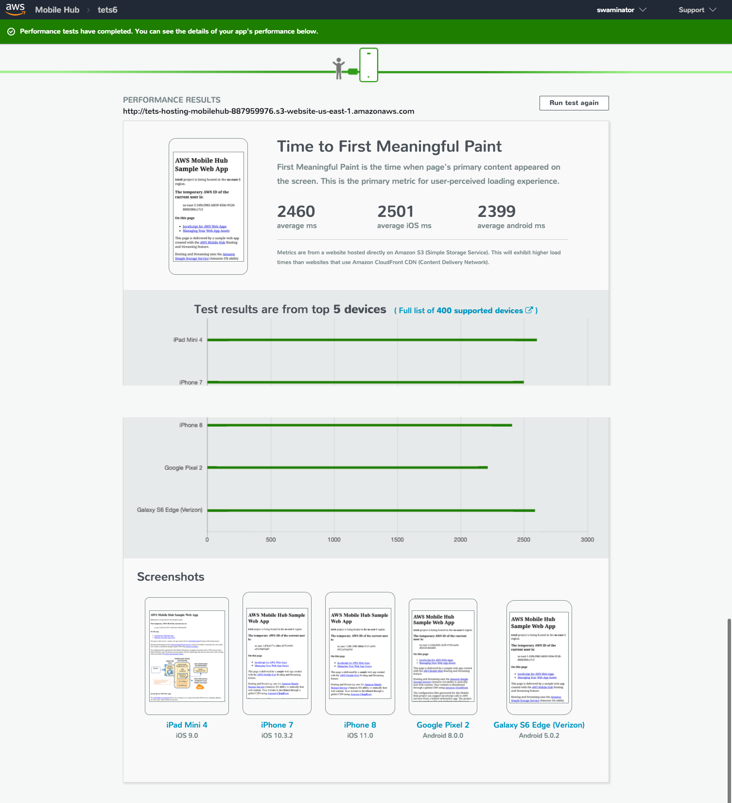

.. Copyright 2010-2018 Amazon.com, Inc. or its affiliates. All Rights Reserved.

   This work is licensed under a Creative Commons Attribution-NonCommercial-ShareAlike 4.0
   International License (the "License"). You may not use this file except in compliance with the
   License. A copy of the License is located at http://creativecommons.org/licenses/by-nc-sa/4.0/.

   This file is distributed on an "AS IS" BASIS, WITHOUT WARRANTIES OR CONDITIONS OF ANY KIND,
   either express or implied. See the License for the specific language governing permissions and
   limitations under the License.

.. _web-getting-started:

###########
Get Started
###########

.. meta::
    :description:
        Learn how to use |AMHlong| (|AMH|) to create, build, test and monitor mobile apps that are
        integrated with AWS services.

.. toctree::
     :titlesonly:
     :maxdepth: 1
     :hidden:

     Add Analytics <web-add-analytics>
     Add User Sign-in <web-add-user-sign-in>
     Add NoSQL Database <web-access-databases>
     Add User Data Storage <web-add-storage>
     Add Cloud Logic <web-access-apis>

.. _web-getting-started_overview:

Overview
========

The AWS Mobile CLI provides a command line experience that allows frontend JavaScript developers to quickly create and integrate AWS backend resources into their mobile apps.

.. _web-getting-started_prerequisites:

Prerequisites
=============

#. `Sign up for the AWS Free Tier <https://aws.amazon.com/free/>`__.

#. Install `Node.js <https://nodejs.org/en/download/>`__ with NPM.

#. Install AWS Mobile CLI

   .. code-block:: bash

       npm install -g awsmobile-cli

#. Configure the CLI with your AWS credentials

   To setup permissions for the toolchain used by the CLI, run:

   .. code-block:: bash

      awsmobile configure

   If prompted for credentials, follow the steps provided by the CLI. For more information, see :ref:`provide IAM credentials to AWS Mobile CLI <aws-mobile-cli-credentials>`.

.. _web-getting-started-create-or-integrate:

Set Up Your Backend
===================

.. list-table::
   :widths: 1

   * - Need to create a quick sample React app? See `Create a React App <https://reactjs.org/blog/2016/07/22/create-apps-with-no-configuration.html>`__.

**To configure backend features for your app**

#. In the root folder of your app, run:

   .. code-block:: bash

        awsmobile init

   The :code:`init` command creates a backend project for your app. By default, analytics and web hosting are enabled in your backend and this configuration is automatically pulled into your app when you initialize.

#. When prompted, provide the source directory for your project. The CLI will generate :file:`aws-exports.js` in this location. This file contains the configuration and endpoint metadata used to link your frontend to your backend services.

   .. code-block:: bash

      ? Where is your project's source directory:  src

#. Respond to further prompts with the following values.

   .. code-block:: bash

      ? Where is your project's distribution directory to store build artifacts:  dist
      ? What is your project's build command:  npm run-script build
      ? What is your project's start command for local test run:  npm run-script start
      ? What awsmobile project name would you like to use:  YOUR-APP-NAME-2017-11-10-15-17-48

After the project is created you will get a success message which also includes details on the path where the aws-exports.js is copied.

    .. code-block:: bash

        awsmobile project's details logged at: awsmobilejs/#current-backend-info/backend-details.json
        awsmobile project's access information logged at: awsmobilejs/#current-backend-info/aws-exports.js
        awsmobile project's access information copied to: src/aws-exports.js
        awsmobile project's specifications logged at: awsmobilejs/#current-backend-info/mobile-hub-project.yml
        contents in #current-backend-info/ is synchronized with the latest information in the aws cloud

Your project is now initialized.


.. _web-getting-started-configure-aws-amplify:

Connect to Your Backend
=======================

AWS Mobile uses the open source `AWS Amplify library <https://aws.github.io/aws-amplify>`__ to link your code to the AWS features configured for your app.

This section of the guide shows examples using a React application of the kind output by :code:`create-react-app` or a similar tool.

**To connect the app to your configured AWS features**

In :file:`index.js` (or in other code that runs at launch-time), add the following imports.

.. code-block:: javascript

    import Amplify from 'aws-amplify';
    import awsmobile from './YOUR-PATH-TO/aws-exports';

Then add the following code.

.. code-block:: javascript

    Amplify.configure(awsmobile);

Run Your App Locally
--------------------

Your app is now ready to launch and use the default features configured by AWS Mobile.

**To launch your app locally in a browser**

In the root folder of your app, run:

.. code-block:: bash

    awsmobile run

Behind the scenes, this command runs :code:`npm install` to install the Amplify library and also pushes any backend configuration changes to AWS Mobile. To run your app locally without pushing backend changes you cou can choose to run :code:`npm install` and then run :code:`npm start`.

Anytime you launch your app, :ref:`app analytics are gathered and can be visualized<web-add-analytics>` in an AWS console.

.. list-table::
   :widths: 1 6

   * - AWS Free Tier

     - Initializing your app or adding features through the CLI will cause AWS services to be configured on your behalf. The `pricing for AWS Mobile services <http://aws.amazon.com/mobile/pricing>`__ enables you to learn and prototype at little or no cost using the `AWS Free Tier <http://aws.amazon.com/free>`__.

.. _web-getting-started-deploying-and-testing:

Next Steps
==========

.. contents::
   :local:
   :depth: 1

Deploy your app to the cloud
----------------------------

Using a simple command, you can publish your app's frontend to hosting on a robust content distribution network (CDN) and view it in a browser.

**To deploy your app to the cloud and launch it in a browser**

In the root folder of your app, run:

.. code-block:: bash

    awsmobile publish

To push any backend configuration changes to AWS and view content locally, run :code:`awsmobile run`. In both cases, any pending changes you made to your backend configuration are made to your backend resources.

By default, the CLI configures AWS Mobile :ref:`Hosting and Streaming <hosting-and-streaming>` feature, that hosts your app on `Amazon CloudFront <https://aws.amazon.com/cloudfront/>`__ CDN endpoints. These locations make your app highly available to the public on the Internet and support `media file streaming <http://docs.aws.amazon.com/mobile-hub/latest/developerguide/url-cf-dev;Tutorials.html>`__

You can also :ref:`use a custom domain <web-host-frontend>` for your hosting location.

Test Your App on Our Mobile Devices
-----------------------------------

Invoke a free remote test of your app on a variety of real devices and see results, including screen shots.

**To invoke a remote test of your app**

In the root folder of your app, run:

.. code-block:: bash

    awsmobile publish --test

The CLI will open the reporting page for your app in the |AMH| console to show the metrics gathered from the test devices. The device that runs the remote test you invoke resides in `AWS Device Farm <https://aws.amazon.com/device-farm/>`__ which provides flexible configuration of tests and reporting.

.. _web-getting-started-add-features:

Add Features
------------

Add the following AWS Mobile features to your mobile app using the CLI.

    * :ref:`Analytics <web-add-analytics>`

    * :ref:`User Sign-in <web-add-user-sign-in>`

    * :ref:`NoSQL Database <web-access-databases>`

    * :ref:`User Data Storage <web-add-storage>`

    * :ref:`Cloud Logic <web-access-apis>`

Learn more
----------

To learn more about the commands and usage of the AWS Mobile CLI, see the :ref:`AWS Mobile CLI reference<aws-mobile-cli-reference>`.

Learn about `AWS Mobile Amplify <https://aws.github.io/aws-amplify>`__.

